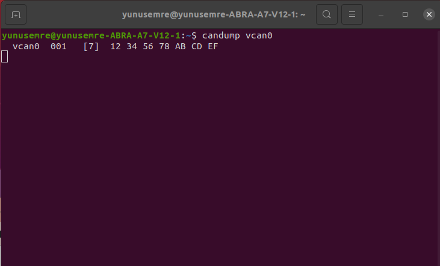

# **CAN-Bus-with-Python**


>"CAN Bus 1980'li yıllarda Robert BOSCH tarafından geliştirilmiş bir iletişim protokoldür. Hızlı ve hata oranının çok düşük olması sebebi ile günümüzde otomotiv sektöründe yaygın olarak kullanılmaktadır. 
Diğer iletişim protokollerine göre farkı; elektronik birimlerin adreslendiği master-slave metodu yerine mesajların adreslendiği multimaster bir yapıda olmasıdır."


>"**Siz de kendi bilgisayarınızda sanal bir CAN Bus hattı simüle ederek çalışmalarınızı gerçekleştirebilirsiniz**"


### NOT: CAN Bus hattı linux işletim sistemi üzerinde simüle edilmektedir. Eğer linux işletim sistemi kurulu bir bilgisayarınız yoksa Windows üzerine virtual machine olarak ubuntu kurarak kolayca çalıştırabilirsiniz.


## STEP 1


```bash
sudo modprobe vcan
```
```bash
sudo ip link add dev vcan0 type vcan
```
```bash
sudo ip link set up vcan0 
```

>"İlk komut satırı ile bilgisarınızda bir nevi can sanal makinası kurdunuz. İkinci komut satırı ile bu sanal makinaya vcan0 adında bir CAN Bus hattı bağlanmanızı sağlar. Üçünü satır ile oluşturduğunuz sanal can hattı etkinleştirilir.  "


## **STEP 2**

>"Artık sanal CAN hattınızı dinleyebilirsiniz. Yapmanız gereken yeni bir teminal açarak aşağıdaki kodu yazmanız"

```bash
candump vcan0
```

>"İlk CAN mesajınızı terminal üzerinden gönderebilirsiniz"

```bash
cansend vcan0 001#1234567890ABCDEF
```

>"Yukarıda verilen kod satırı ile can0 hattına 001 adresli 123456789ABCDEF mesajı göndermiş olduk."




## STEP 3 

>"Aşağıdaki komut ile tek tek mesaj yollamak yerine bilgisayarın sizin için rastgele can mesajları göndermesini sağlayabilirsiniz"

```bash
cangen vcan0
```


[](images/Screencast2021-12-28 21_50_38.mp4)


## STEP 4 

>"python ile CAN Bus operasyonları yapabilmek için python-can kütüphanesini kuralım"
```bash
pip install python-can
```


>"Şimdi herhangi bir python dosyası oluşturup aşağıdaki kod ile can hattını dinleyerek yazdırabilirsiniz"

```python
import can 

bus = can.interface.Bus(bustype = "socketcan", channel= "vcan0", bitrate = 250000)

while True:
    msg = bus.recv()
    print(msg)
```


[](images/Screencast2021-12-28 21_52_15.mp4)


## SON

>"Merhaba ben YEC, umarım yardımcı olmuştur. Repoya eklediğim örnek kodları inceleyip python kullanarak mesaj gönderme, alma ve filtreleme gibi birçok farklı çalışma yapabilirsiniz. Linkedin hesabımdan beni takip edebilir ve sorularınızı sorabilirsiniz."

[Linkedin](https://www.linkedin.com/in/yunus-emre-co%C5%9Fkun-84a330202/)


